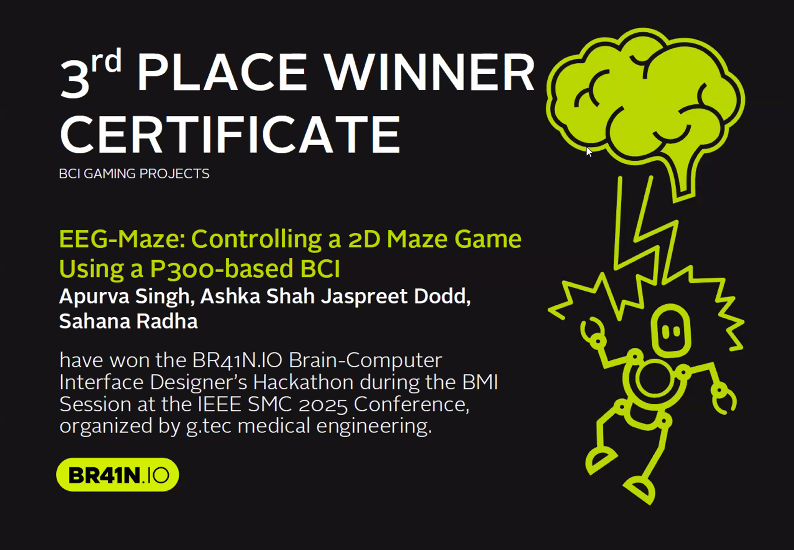

# MindMaze 🧠🕹️
**3rd Place Winner – g.Tech Hackathon 2025 (Gaming Category)**  

---
## 🧩 Overview 🧩

Our team set out to build a real-time Brain-Computer Interface (BCI) game that allows users to navigate a 2D maze using EEG signals

We used the **Unicorn Hybrid Black** headset with the **Unicorn Suite** - specifically the **Speller module** for signal acquisition and classifier training. The classifier output interfaced via UDP network to a **Python-based** 2D maze game.

The goal was to build a *plug-and-play neurogaming demo* that:
- Captures event-related potentials (ERPs) via P300 task design.  
- Classifies attention-driven responses. 
- Sends UDP signals to control game states in PyGame. 

---

## ⚒️ System pipeline ⚒️

---

## 📋 Implementation 📋
- **Hardware:** Unicorn Hybrid Black 8-channel EEG headset 
- **Software:** Unicorn Suite, Python
- **Integration:** LSL not required; we used direct Unicorn API + UDP networking 
- **Code Highlights:**
  - `main.py` manages both the game loop and signal-triggered input.
  - `eeg_processing.py` handles classifier output from Unicorn and turns into user-controlled input for maze game.

--- 

## 🎮 Demo 🎮 

---

## 📊 Results 📊
- Reliable detection of P300 attention spikes within Unicorn Suite .
- 3-directional control for maze navigation. 
- Successful real-time control of PyGame-based gameplay with sub-300ms latency post-classification.
- 3rd Place in Gaming Category (70+ total teams across 3 categories)

---

## 💭 Reflection 💭 
This hackathon provided hands-on insight into the challenges of EEG-BCI integration:
- **Hardware–software interfacing** is often the main bottleneck.  
- Pre-built classifier pipelines can accelerate prototyping but limit flexibility.  
- Team coordination between in-person and remote contributors can still work beautifully when roles are clear.

See detailed write-up in [`docs/reflection.md`](docs/reflection.md).

---

## 🧑‍🔬 Contributors 🧑‍🔬
| Name | Role |
|------|------|
| Apurva Singh | EEG Signal Recording, Unicorn board setup, Write-up|
| Ashka Shah | Game UI and integration, UDP/IP Networking, Presentation|
| Jaspreet Dodd | EEG setup and calibration, Speller redesign|
| Sahana Radha | Board design, Pipeline optimization, UDP networking |

---

## 👑 Acknowledgements 👑
Special thanks to **Queens University** for providing access to Unicorn Hybrid Black and development tools. 
Specifically, **Dr. Susan Boehnke**, **Dr. Ethan Heming**, and **Matthew Jacobs**  for their guidance and technical support.
Also thanks to the **gtec. medical engineering** for creating a space to explore neurogaming creativity.

Original [The-Maze-Game](https://github.com/hoangsonww/The-Maze-Game?tab=readme-ov-file) interface designed by [Son Nyugen](https://github.com/hoangsonww)

---